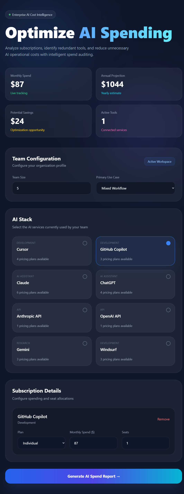
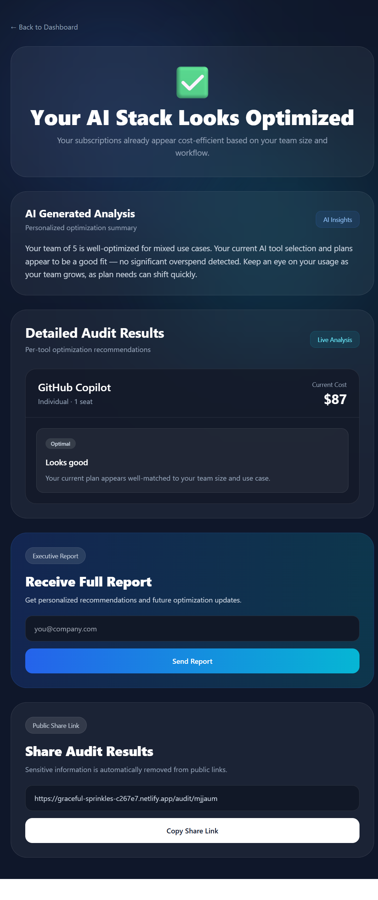
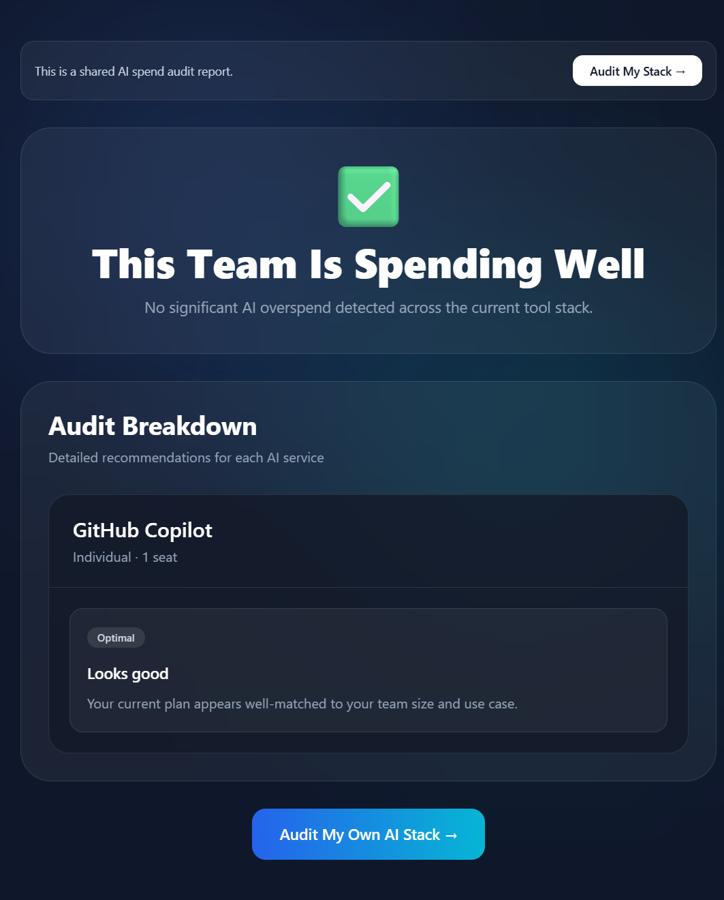

# AI Spend Audit

AI Spend Audit is a SaaS-style web application that helps startups analyze AI subscription spending, identify overspending, and discover lower-cost alternatives.

Built as a lead-generation product for Credex, the platform generates personalized AI cost audits, estimated savings opportunities, and public shareable reports.

---
Designed to help startups quickly identify unnecessary AI subscription costs and optimize operational spending.
# Live Demo

[Live Application](https://graceful-sprinkles-c267e7.netlify.app/)

---

# Features

* AI tool spend input dashboard
* Personalized savings recommendations
* Monthly + annual savings calculations
* AI-generated audit summaries
* Shareable public audit URLs
* Lead capture flow
* Supabase backend integration
* Responsive SaaS-style UI
* Local persistence with localStorage
* Public audit sharing without exposing sensitive data

---
# How It Works

1. User selects AI tools currently used by their team
2. Spend and seat information is submitted
3. Audit engine evaluates pricing inefficiencies
4. Savings opportunities are calculated
5. AI-generated summary is created
6. Results are stored and shareable via public URL

---
# Tech Stack

## Frontend

* React
* Vite
* Tailwind CSS
* Framer Motion
* React Router

## Backend / Services

* Supabase
* OpenRouter API
* Resend (email architecture prepared)

---

# Screenshots

## Home Dashboard



---

## Audit Results Page



---

## Public Shareable Audit



---

# Project Structure

```txt
src/
├── components/
├── pages/
├── engine/
├── lib/
├── services/
├── tests/
└── assets/

public/
└── screenshots/
```

---

# Quick Start

```bash
git clone https://github.com/aasishsharma0901-png/ai-spend-audit.git

cd ai-spend-audit

npm install

npm run dev
```

---

# Environment Variables

Create a `.env` file in the project root:

```env
VITE_SUPABASE_URL=your_supabase_url

VITE_SUPABASE_ANON_KEY=your_supabase_anon_key

VITE_OPENROUTER_API_KEY=your_openrouter_api_key

VITE_RESEND_API_KEY=your_resend_api_key
```

Do NOT commit `.env` files or API keys to GitHub.

---

# Running Locally

```bash
npm run dev
```

Application runs at:

```txt
http://localhost:5173
```

---

# Deployment

The application is deployed on Netlify.

For React Router support, the following redirect rule is included:

```txt
/* /index.html 200
```

---

# Decisions & Tradeoffs

## 1. Rule-Based Audit Engine Instead of AI Calculations

The audit engine itself is intentionally rule-based for reliability and transparency.

Financial recommendations should be deterministic and explainable.

AI is only used for personalized summaries.

---

## 2. Client-Heavy Architecture

Most calculations happen client-side to improve responsiveness and reduce backend complexity during MVP development.

---

## 3. Supabase Instead of Custom Backend

Supabase was chosen to accelerate development speed while still supporting:

* persistent storage
* shareable public URLs
* lead capture
* simple backend integration

---

## 4. Vite Instead of Next.js

Vite provided:

* faster setup
* simpler deployment
* lower complexity
* faster hot reload during development

This matched the assignment’s rapid-shipping requirements.

---

## 5. SaaS Dashboard UI Approach

The UI was redesigned from a simple form interface into a modern SaaS-style dashboard to improve usability, polish, and presentation quality.

Focus areas included:

* glassmorphism styling
* responsive layouts
* visual hierarchy
* smooth interactions
* mobile responsiveness

---

# Future Improvements

* PDF export
* Benchmark comparisons
* Real transactional email deployment
* Analytics dashboard
* Referral system
* Team collaboration mode
* Historical audit tracking
* Spend trend visualizations

---

# Testing

Run tests with:

```bash
npm run test
```

---

# Documentation

Additional project documentation:

* ARCHITECTURE.md
* DEVLOG.md
* TESTS.md
* PRICING_DATA.md
* PROMPTS.md
* GTM.md
* ECONOMICS.md
* METRICS.md
* USER_INTERVIEWS.md

---

# Author

Built by Aasish Sharma for the Credex Web Development Internship Assignment.

---
